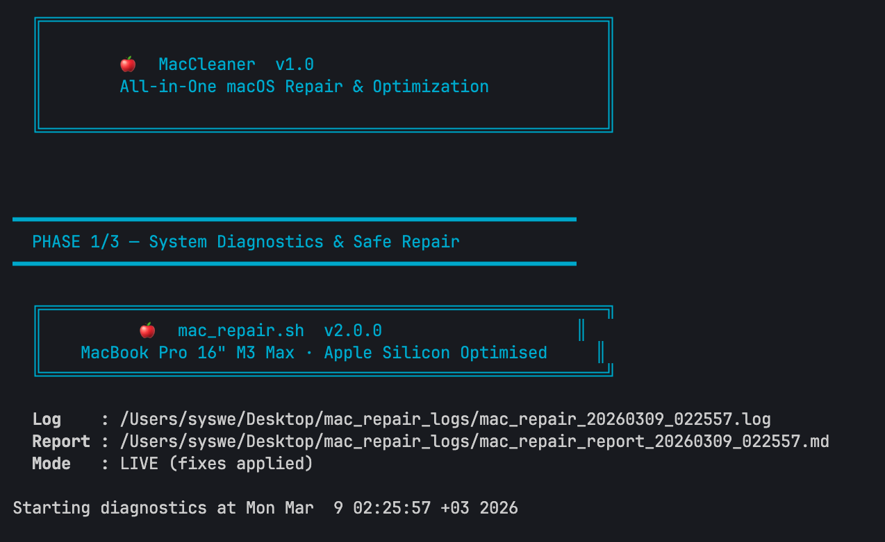
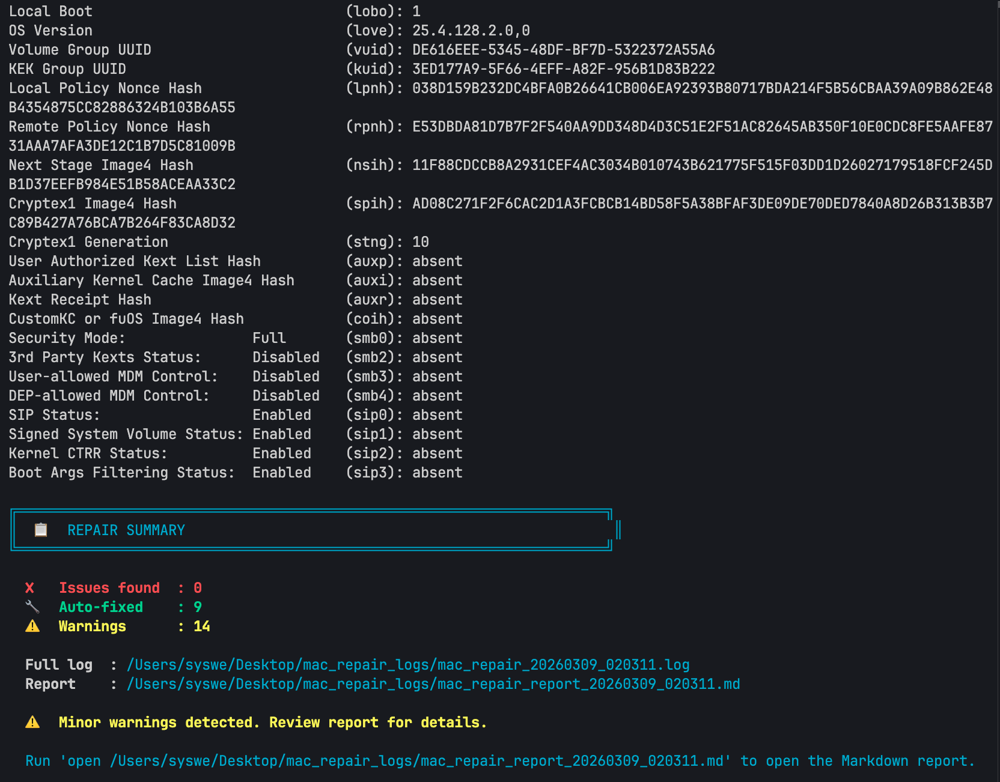

# 🍎 MacCleaner

All-in-one macOS diagnostic, repair, and optimization toolkit — built for **Apple Silicon** Macs.

Designed and tested on a **Macbook Apple Silicons**, but works on any modern Mac running macOS Tahoe (26).



---

## Quick Start

```bash
git clone https://github.com/YOUR_USERNAME/mac-repair.git
cd mac-repair
chmod +x *.sh
sudo ./run.sh
```

## What It Does

MacCleaner runs a **3-phase pipeline** to diagnose, clean, and optimize your Mac:

| Phase | Script | Purpose |
|-------|--------|---------|
| **1** | `mac_repair.sh` | Full system diagnostics & safe auto-repair |
| **2** | `mac_fix_v2.sh` | Aggressive cleanup (Trash, xattr bloat, crash logs, DNS) |
| **3** | `mac_fix_v3.sh` | Deep remediation (Xcode, Homebrew, caches, temp files) |

### Phase 1 — Diagnostics (`mac_repair.sh`)

12 diagnostic modules that scan every layer of macOS:

| # | Module | Checks |
|---|--------|--------|
| 1 | System Info | macOS version, SIP, FileVault, battery health, Rosetta 2 |
| 2 | Disk Health | SMART status, APFS verify, disk usage, large files, broken symlinks |
| 3 | LaunchAgents | Plist integrity, missing executables, known adware patterns |
| 4 | Network | DNS, proxy, `/etc/hosts` tampering, open ports |
| 5 | Preferences | Plist corruption & auto-reset of critical Apple prefs |
| 6 | Security | `sudoers`, SSH permissions, Gatekeeper, quarantine, kexts |
| 7 | Performance | Memory pressure, swap, top CPU/RAM consumers, thermal throttling |
| 8 | Cache | User/system caches, DNS flush, font cache, Homebrew, npm |
| 9 | Logs | Kernel panics, crash reports, APFS errors, IOKit hardware errors |
| 10 | Apple Silicon | M-series native vs Rosetta, ANE, Secure Enclave, boot policy |
| 11 | Maintenance | Periodic tasks, Time Machine, software updates, Spotlight |
| 12 | NVRAM | Boot-args anomalies, dangerous security bypasses |

### Phase 2 — Cleanup (`mac_fix_v2.sh`)

Targets common bloat sources discovered during Phase 1:

- 🗑️ Force-empties Trash
- 🏷️ Strips metadata bloat (`com.apple.quarantine`, `kMDItemWhereFroms`) from user files
- 📋 Wipes old crash reports in `/Library/Logs/DiagnosticReports`
- 🌐 Flushes DNS cache and restarts `mDNSResponder`
- 🧹 Deep wipes `~/Library/Caches` and `/Library/Caches`

### Phase 3 — Remediation (`mac_fix_v3.sh`)

Goes deeper into system-level optimization:

- 🔨 Clears Xcode DerivedData and Swift Package Manager caches
- 🍺 Runs `brew update && brew upgrade && brew cleanup && brew doctor`
- 🌐 Audits `/etc/hosts` for suspicious redirects
- ⚙️ Reports LaunchD services with non-zero exit codes
- 💾 Deep prunes `~/Library/Caches` (safe targets only)
- 🔑 Audits login items and background tasks
- 📦 Reports Application Support and Group Container sizes (Docker, Slack, etc.)
- 🗂️ Wipes stale `/tmp` files
- 🔋 Battery health assessment (cycle count, max capacity)

---

## Usage

```bash
# Full pipeline — diagnose, clean, and optimize
sudo ./run.sh

# Preview only — see what would happen without making changes
sudo ./run.sh --dry-run

# Skip Homebrew upgrade (saves time if you have many packages)
sudo ./run.sh --skip-brew

# Skip Xcode DerivedData cleanup
sudo ./run.sh --skip-xcode

# Combine flags
sudo ./run.sh --dry-run --skip-brew
```
> These scripts take some time to run (about 3-5 minutes). 

>Disks can stuck while these scripts running please don't do anything while scripts running.

### Run Individual Scripts

```bash
# Just diagnostics
sudo ./mac_repair.sh

# Just diagnostics for a single module
sudo ./mac_repair.sh --module=disk

# Just the aggressive cleanup
sudo ./mac_fix_v2.sh

# Just the deep remediation
sudo ./mac_fix_v3.sh --skip-brew
```

---

## Output

Every run generates timestamped logs and a Markdown report on your **Desktop**:

```
~/Desktop/mac_repair_logs/
├── mac_repair_20260309_020311.log          # Phase 1 raw log
├── mac_repair_report_20260309_020311.md    # Phase 1 Markdown report
├── mac_fix_v2_20260309_021254.log          # Phase 2 raw log
└── mac_fix_v3_20260309_021607.log          # Phase 3 raw log
```


> Please check all Phase's Outputs one by one. 

---

## Requirements

- **macOS 26+ (Tahoe - Latest)**
- **Apple Silicon** (M1/M2/M3/M4/M5)
- `sudo` access for full functionality
- Optional: `brew`, `npm`, `pip3` for package-specific cleanup

---

## Safety

- Phase 1 is **read-only** by default — it diagnoses but only applies safe, reversible fixes (e.g., permission corrections).
- APFS repair is intentionally **not** run on a mounted volume — the script advises using Recovery Mode.
- All scripts support `--dry-run` to preview every action before committing.
- Corrupt plists are **backed up** before deletion.
- No system files under `/System` are ever modified.

---

## License

MIT
